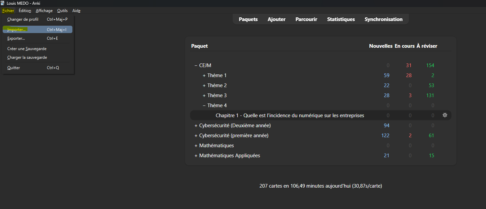
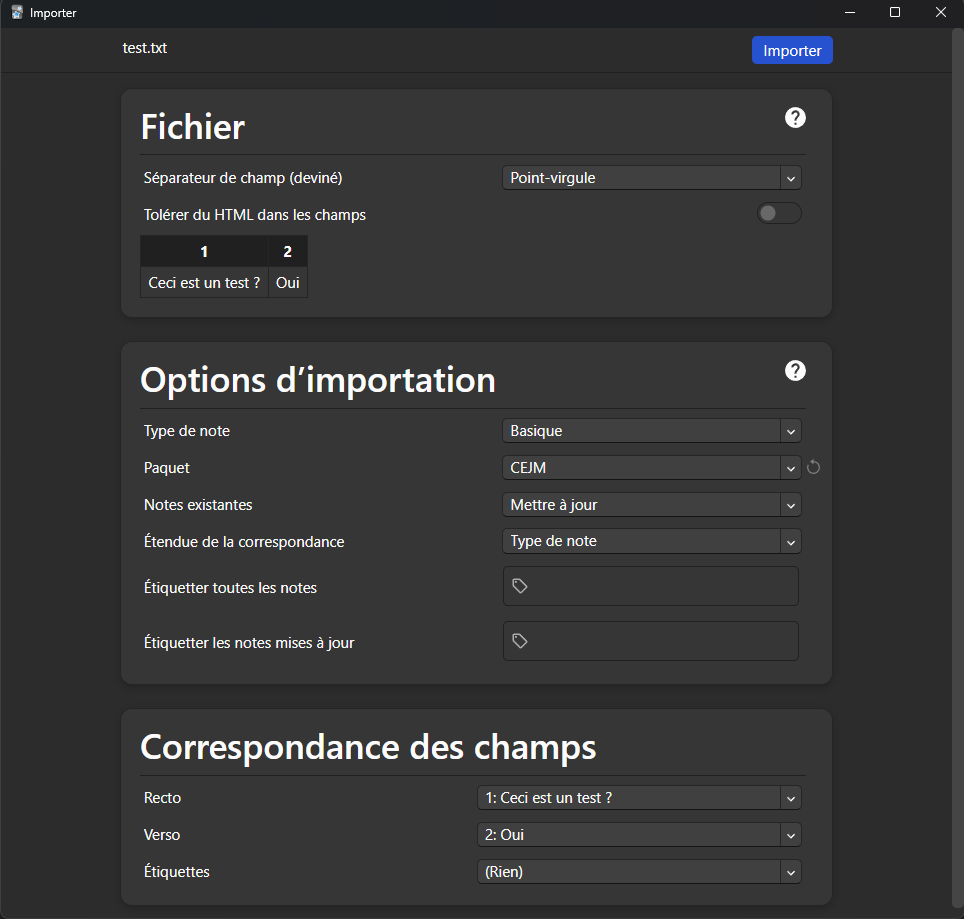

# BTS Révision

## Contexte

BTS Révision regroupe des fiches de révision pour le BTS SIO. Les supports couvrent actuellement la CEJM, la cybersécurité et les mathématiques. Les fichiers texte sont structurés pour pouvoir être relus dans un éditeur ou importés directement dans [Anki](https://apps.ankiweb.net/).

-----

## Structure du dépôt

```text
.
├── bts-sio/
│   ├── cejm/
│   ├── cybersecurite/
│   └── mathématiques/
├── prompt.md
└── readme.md
```

- **`bts-sio/`** : regroupe les supports de révision par matière.
- **`bts-sio/cejm/`** : fiches de culture économique, juridique et managériale.
- **`bts-sio/cybersecurite/`** : fiches consacrées aux menaces, attaques et outils de cybersécurité.
- **`bts-sio/mathématiques/`** : fiches de mathématiques, dont le calcul booléen.
- **`*.txt`** : cartes question-réponse prêtes à être consultées ou importées dans Anki.

-----

## Utilisation

### Cloner le dépôt

```bash
git clone git@github.com:FireToak/bts-revision.git
cd bts-revision
```

Les fiches peuvent ensuite être ouvertes avec n’importe quel éditeur de texte compatible UTF-8.

-----

## Ajouter les flashcards dans Anki

### 1. Ouvrir l’importeur

Dans Anki, sélectionnez **Fichier > Importer**, puis choisissez la fiche `.txt` à ajouter. Sélectionnez ou créez le paquet de destination.


*Lancer l'importation des flashcards.*

### 2. Configuration de l'importation

Une fois dans le menu d'importation, laisser les paramètres par défaut et cliquer sur **Importer**.


*Configuration de l'importation des flashcards.*

-----

## Bonnes pratiques et sécurité

1. **Conserver l’encodage UTF-8** : il préserve les accents, les symboles et les expressions mathématiques.
2. **Vérifier l’aperçu avant import** : une mauvaise sélection du séparateur décale les champs et rend les cartes illisibles.
3. **Sauvegarder la collection Anki** : exportez régulièrement une sauvegarde avant un import massif ou une modification importante.

-----

## 👨‍💻 Mainteneur

- **Louis MEDO** | [LinkedIn](https://www.linkedin.com/in/louismedo/) | [Portfolio](https://louis.loutik.fr/) | [GitHub](https://github.com/FireToak) | [louis.medo@loutik.fr](mailto:louis.medo@loutik.fr)

-----

<div align="center">
<br>
<small><i>Dernière mise à jour : 31 août 2026</i></small>
</div>
